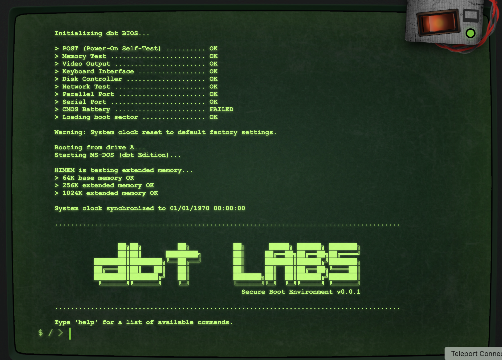

# Retro Terminal

A throwback retro CRT-style terminal application with a beautiful, nostalgic interface. This application provides an interactive terminal experience with classic CRT monitor effects, including scanlines, screen flicker, phosphor color options, and secure authentication.

**Demo:** [Link](https://cr0n1c.github.io/funWithFlags/)



## Features

- 🖥️ Authentic CRT monitor effects
- 🎨 Switchable phosphor colors (Amber/Green)
- 🔊 Retro sound effects (power on/off, keypress)
- ⌨️ Interactive terminal with command history
- 📺 Fullscreen mode support
- 💾 Command auto-completion
- 🎮 Responsive design for all screen sizes
- 🔐 Secure Okta authentication
- 🔄 Session persistence

## Available Commands

- `help` - Display a list of available commands
- `date` - Show the current date and time
- `clear` - Clear the terminal output
- `about` - Learn more about the application
- `login` - Authenticate using Okta
- `logout` - End your session

## Prerequisites

- Node.js (v14 or higher)
- npm (v6 or higher)
- Okta developer account (for authentication features)

## Installation

1. Clone the repository:
   ```bash
   git clone https://github.com/Cr0n1c/funWithFlags.git
   cd funWithFlags
   ```

2. Install dependencies:
   ```bash
   npm install
   ```

3. Configure Okta authentication:
   - Create an Okta developer account
   - Set up a new OIDC application
   - Configure the allowed origins and redirect URIs
   - Update the Okta configuration in your environment

## Development

To run the application in development mode:

```bash
npm run start:dev
```

This will:
- Start a development server on port 8888
- Watch for changes in the source files
- Automatically rebuild when changes are detected
- Handle process management (Ctrl+C will properly terminate all processes)

### Development Server Features

The development environment includes:
- Live reload capability
- Process management for nodemon and http-server
- Clean shutdown with Ctrl+C
- No-cache headers for development testing
- Source file watching for immediate updates

### Development Scripts

- `npm run start:dev` - Start development server with live reload
- `npm run build:dev` - Build for development
- `npm run sass:watch` - Watch SASS files for changes
- `npm run clean` - Clean build directories

## Production Build

To create a production build:

```bash
npm run build:prod
```

This will:
- Clean the previous build
- Copy and process source files
- Compile SASS to CSS
- Minify HTML
- Generate optimized assets in the `dist` directory

To run the production build locally:

```bash
npm run start:prod
```

This will start a server on port 8080.

## Browser Compatibility

The application works best in modern browsers with the following considerations:

### Third-Party Cookies
- Chrome's new cookie policies may affect authentication
- Users will be notified if third-party cookies are disabled
- Instructions are provided for enabling necessary cookies
- Alternative browsers may be recommended for optimal experience

### Authentication
- Uses popup-based authentication flow
- Supports token-based session management
- Handles CORS configurations automatically
- Provides clear error messages for authentication issues

## Project Structure

```
funWithFlags/
├── src/
│   ├── fonts/        # Custom web fonts
│   ├── images/       # Images and assets
│   ├── js/
│   │   ├── services/ # Authentication and other services
│   │   ├── handlers/ # Event handlers
│   │   └── terminal/ # Terminal functionality
│   ├── sass/         # SASS stylesheets
│   └── index.html    # Main HTML file
├── scripts/          # Build and utility scripts
├── dist/             # Production build output
├── release/          # Temporary deployment directory
├── docs/             # Houses artifacts for README.md
└── package.json      # Project configuration
```

## Customization

### Changing Theme Colors

The application supports two phosphor colors:
- Amber (default)
- Green

You can toggle between them using the theme button in the top-right corner.

### Sound Effects

Sound effects can be customized by replacing the audio files in the `src/sounds` directory:
- `power_on.mp3` - Played when terminal starts
- `power_off.mp3` - Played when terminal shuts down
- `keypress.mp3` - Played when typing

### Authentication Configuration

The authentication can be customized by modifying:
- Okta application settings
- Token management preferences
- Session timeout values
- Error message templates

## Contributing

1. Fork the repository
2. Create your feature branch (`git checkout -b feature/amazing-feature`)
3. Commit your changes (`git commit -m 'Add some amazing feature'`)
4. Push to the branch (`git push origin feature/amazing-feature`)
5. Open a Pull Request

## License

This project is licensed under the MIT License - see the [LICENSE](LICENSE) file for details.

## Authors

- Brandon Helms
- George Merlocco <george@merloc.co>

## Acknowledgments

- Inspired by classic CRT monitors and retro computing
- Built with modern web technologies while maintaining a vintage aesthetic
